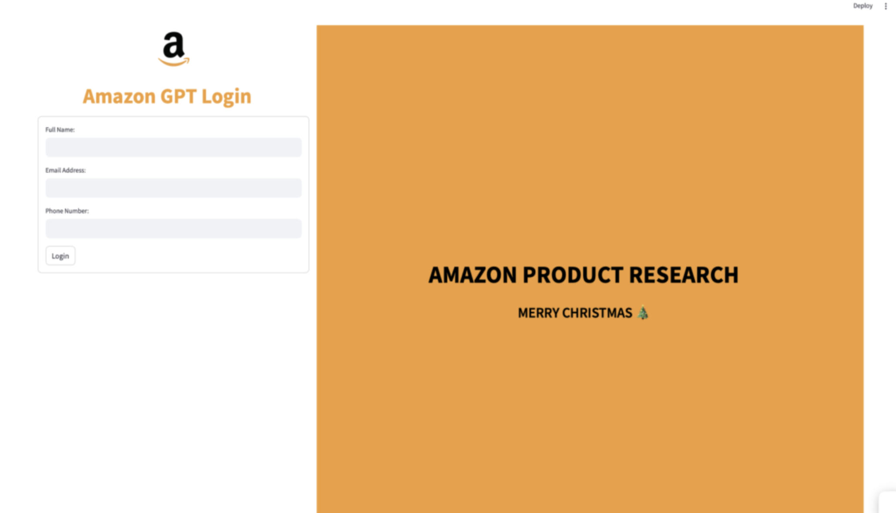
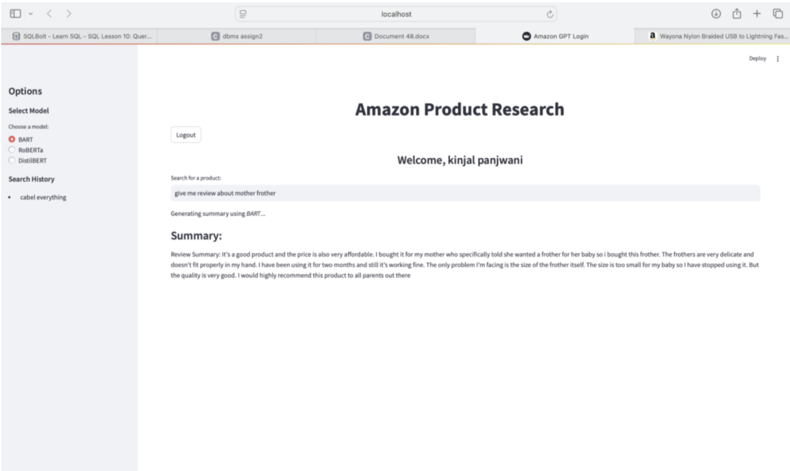
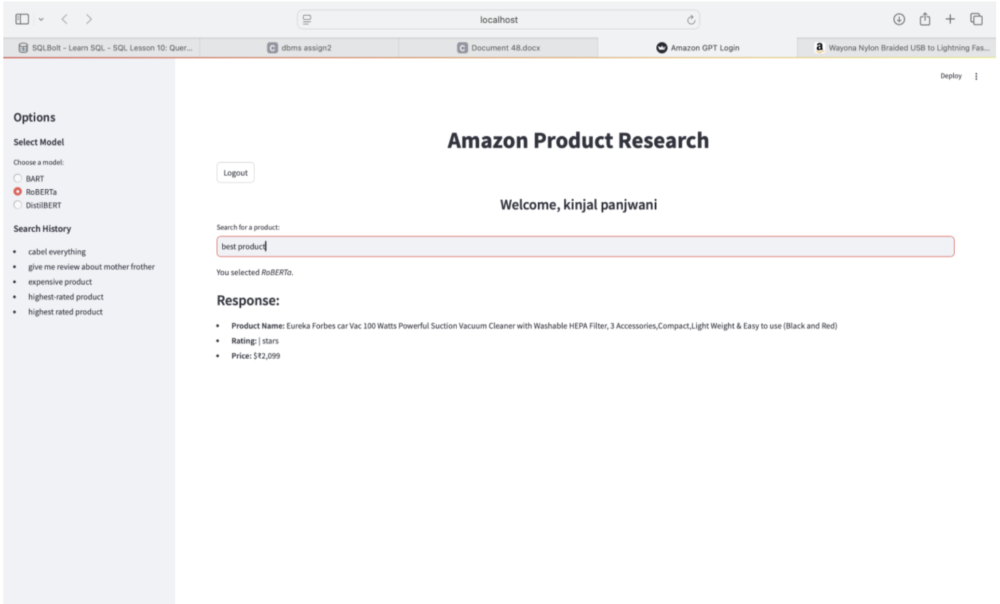
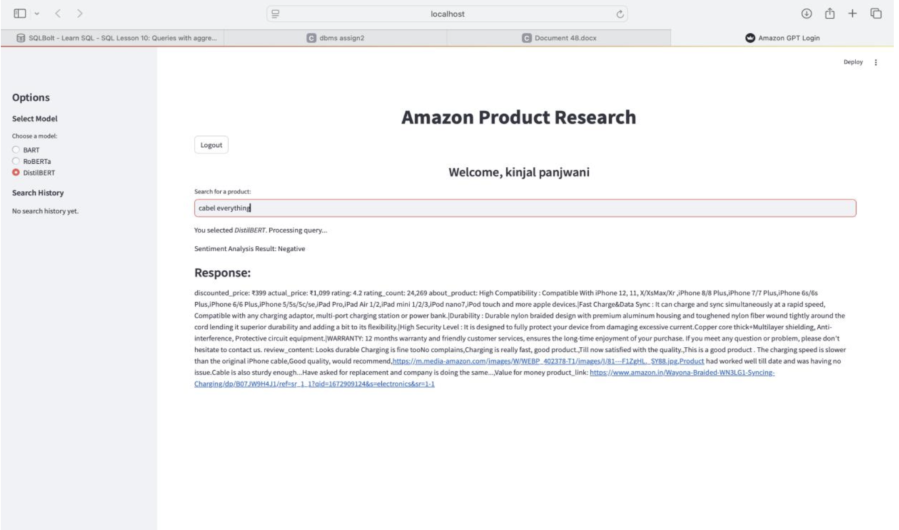
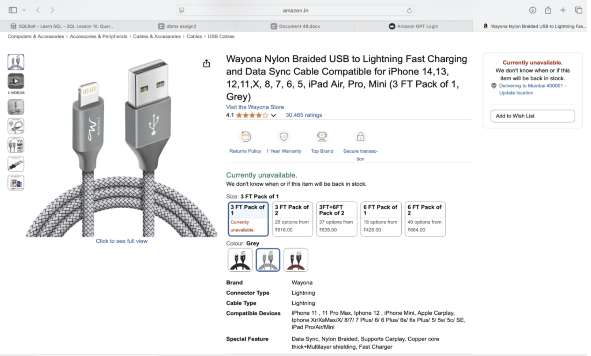

## Project Images

### Application Interface

### NLP Models Used

**BART-based Summarization**

**RoBERTa-based Sentiment Analysis**

**Distilbert-based Overall Review**

### Model & Pipeline Overview

# Amazon GPT

Amazon GPT is a domain-specific AI assistant designed to support **product research and decision-making** on Amazon.  
It analyzes user queries and product-related text to provide **insightful summaries, sentiment-aware opinions, and structured recommendations**, helping users make informed purchasing decisions efficiently.

The system focuses on **understanding product reviews, extracting meaningful signals, and presenting them in a conversational format**.

---

## Project Motivation

Online shopping platforms often overwhelm users with large volumes of reviews and mixed opinions.  
This project explores how NLP and transformer-based models can:
- Reduce information overload
- Surface sentiment trends
- Assist users in evaluating products more effectively

---

## Key Features

- Conversational interface for product-related queries  
- Review and opinion analysis using NLP models  
- Sentiment-aware product insights  
- User-specific search history tracking  
- Modular backend architecture for extensibility  

---

